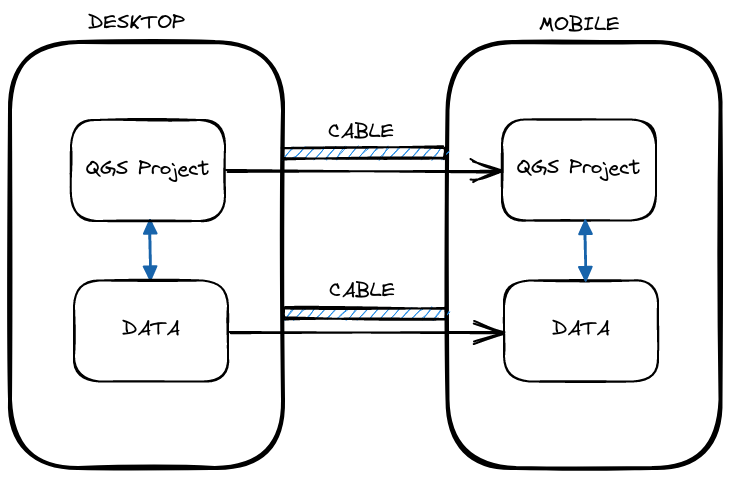
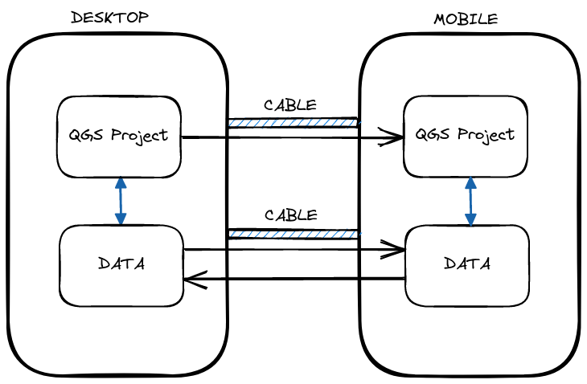
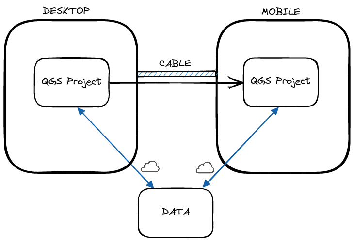
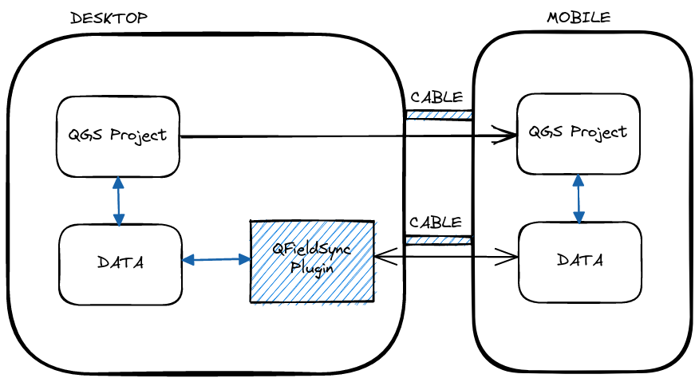
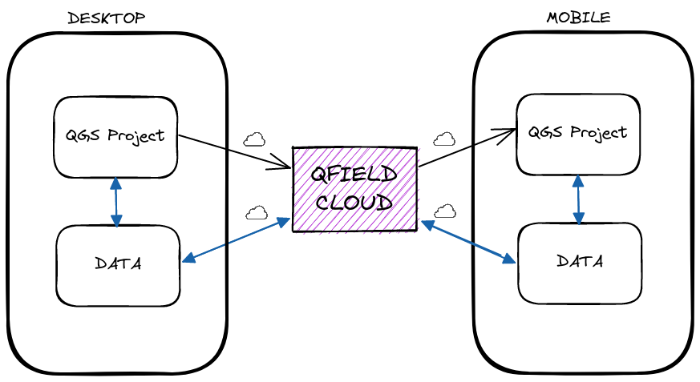
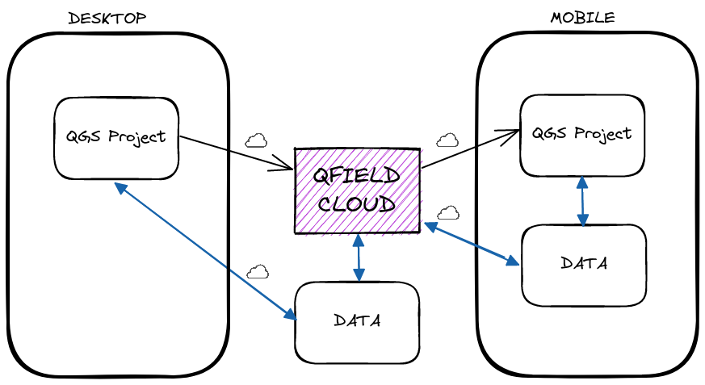

# QField
## Because data is outside

---

#### Open source Geoninjas
### Made in Switzerland

---
###### Linda Indra-Camathias
MSc in Geography @ Uni Bern
GIS Expert
Mountain Lover and Mother

###### David Signer
BSc in Software Engineering @ ZHAW
Coordinator and QGIS Core Comitter
Dreamer and Storyteller

---

### Teil 1 ☕
- Über QField (Präsi)
- Konfiguration auf QGIS (Demo)
- QField Cloud (Demo)
- Arbeiten mit QField (Demo)

---

### Teil 2 🌲
- Let's play (Übungen draussen)
- Synchronisation (Demo / Übung)
- Weitere Features von QField (Demo)
- Schluss und Fragen
---

## Why
# QField ?

---

## Because
# data is outside
## the office

---

## What is
# QField ?

---

### The mobile data collection app for QGIS

---

##### Minimalist UI

---

##### Beautiful cartography

---

##### Powerful tools

---

##### Efficient interaction

---

##### Beneficial integrations

---

##### Professional hardware

---

##### QFieldCloud

---

##### QField on Windows

---

##### QField on iOS

---

##### qfield.org/get

---

##### Bumblebee
##### 400k downloads
##### 110k monthly users

---

## How to work with
# QField ?

---

##### Comfortably prepare the work on your QGIS desktop

---

##### Efficiently work on your GIS data outdoor

---

##### Seamlessly synchronise

---

## Workflows

---

<!-- see https://excalidraw.com/#json=xudWJENNmWe8KFE0Bvykm,HUFbEvYBbMvfGwTNOjU8tw -->

### The Browser
---

<!-- see https://excalidraw.com/#json=w_pdDlp2P1Vz4BsFVoEJf,NdgGETWi3uiy3N8dyX3jWg -->

### The Lone Ranger
---

<!-- see https://excalidraw.com/#json=A7R83LWIWjlKURIbxhcA5,oRLFmvm84KFV2jxd_sHqHQ -->

### Multi-User Online
---

<!-- see https://excalidraw.com/#json=FpIfkDHzrmcjlzovTTQCP,W7avUQwemNmjxdGn-UoHxw -->

### Multi-User Offline
---

<!-- see https://excalidraw.com/#json=UAkpuk9ThyS0gdEOLZ0OJ,_0nMGZRUCRHCk63wQH3ndw -->

### QFieldCloud

---

<!-- see https://excalidraw.com/#json=UAkpuk9ThyS0gdEOLZ0OJ,_0nMGZRUCRHCk63wQH3ndw -->

### QFieldCloud with DB

---
### So let's cloud!

#### With Teams, roles and conflict management.
---

## QField Feature Frenzy
---

### Live Demo
---

### [Freihandzeichnen](https://qfield.org/docs/fieldwork/digitize.html#freehand-digitizing) 🎥

---

### [Line tracking](https://qfield.org/docs/fieldwork/track_lines_polygons.html?highlight=tracking#track-lines-and-polygons) 🎥

---

### Thanks! Questions?
### qfield.org | qfield.cloud
### @opengisch
### info@opengis.ch